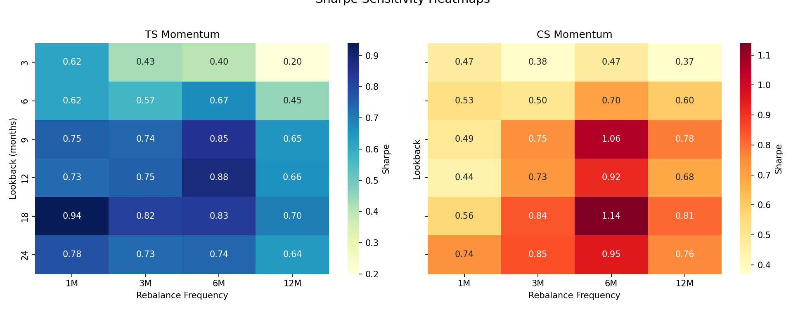

# Strategy Backtests — Results

This project implements and compares different portfolio strategies:
- Equal Weight (EW)  
- Value Weight (VW, using market capitalization)  
- Momentum (Time-Series and Cross-Sectional)  
- Benchmark: S&P500  

---

## 📊 Performance Table

---

## 📈 Capital Growth

---

## ⚖️ Portfolio Weights Over Time

### Equal Weight (EW)

### Value Weight (VW)

### Time-Series Momentum (TS)

### Cross-Sectional Momentum (CS)

---

## 🔎 Sensitivity Analysis — Sharpe Ratio

To evaluate the robustness of the momentum strategies, we ran a sensitivity analysis of Sharpe ratios across different **lookback periods (3, 6, 9, 12, 18, 24 months)** and **rebalance frequencies (1M, 3M, 6M, 12M)**.  

### Combined Heatmaps

- **Time-Series Momentum (TS):** Performs best with intermediate lookbacks (9–18 months), showing stable Sharpe ratios even with less frequent rebalancing.  
- **Cross-Sectional Momentum (CS):** More sensitive to parameter choices; short lookbacks perform poorly, while long lookbacks (18–24 months) with quarterly or semiannual rebalancing achieve the strongest Sharpe ratios.  
