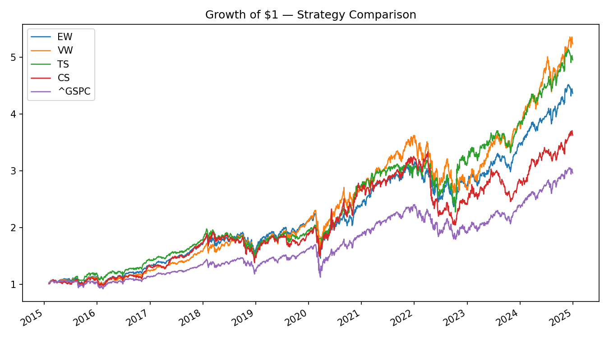
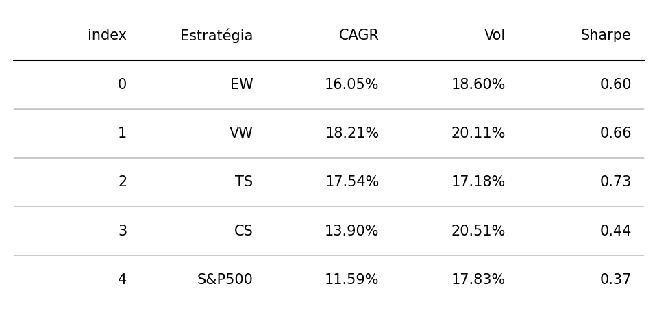
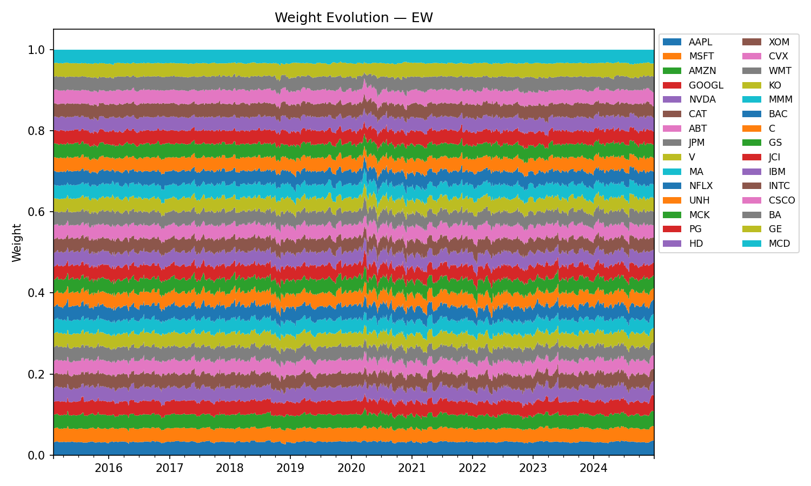
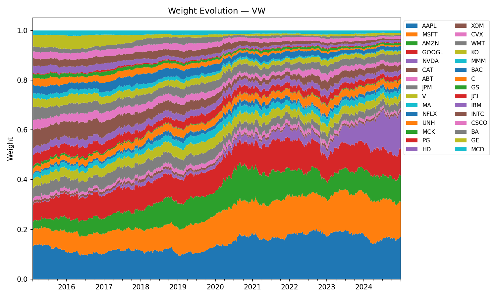
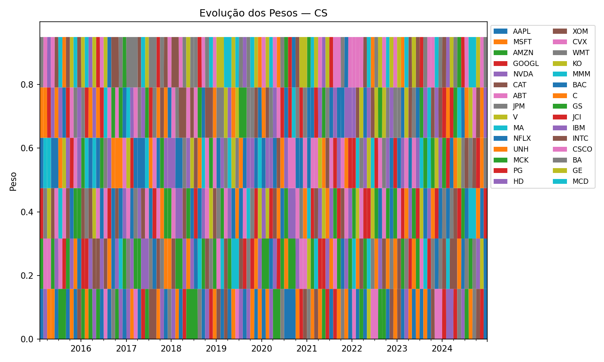

# Portfolio Strategies – Results

## Performance Comparison

## Performance Table

## Sensitivity – Time-Series Momentum

## Sensitivity – Cross-Section Momentum

## Weights Over Time – Equally Weighted (EW)

## Weights Over Time – Value Weighted (VW)

## Weights Over Time – Time-Series Momentum (TS)

## Weights Over Time – Cross-Section Momentum (CS)

