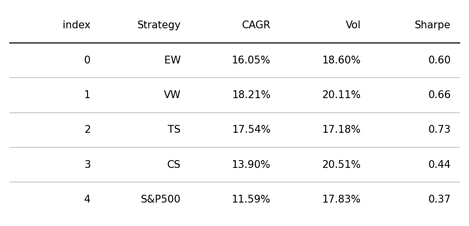
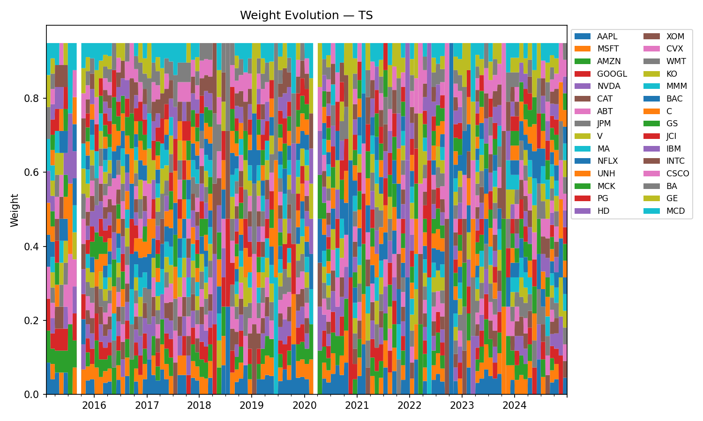

<<<<<<< HEAD
# Strategy Backtests — Results

This project implements and compares different portfolio strategies:
- Equal Weight (EW)  
- Value Weight (VW, using market capitalization)  
- Momentum (Time-Series and Cross-Sectional)  
- Benchmark: S&P500  

---

## 📊 Performance Table

---

## 📈 Capital Growth

---

## ⚖️ Portfolio Weights Over Time

### Equal Weight (EW)

### Value Weight (VW)

### Time-Series Momentum (TS)

### Cross-Sectional Momentum (CS)
=======
# Portfolio Strategies – Results

## Performance Comparison

## Performance Table

## Sensitivity – Time-Series Momentum

## Sensitivity – Cross-Section Momentum

## Weights Over Time – Equally Weighted (EW)

## Weights Over Time – Value Weighted (VW)

## Weights Over Time – Time-Series Momentum (TS)

## Weights Over Time – Cross-Section Momentum (CS)
>>>>>>> c99b366b1e11c5c53082e350e1d17c8478cce772

